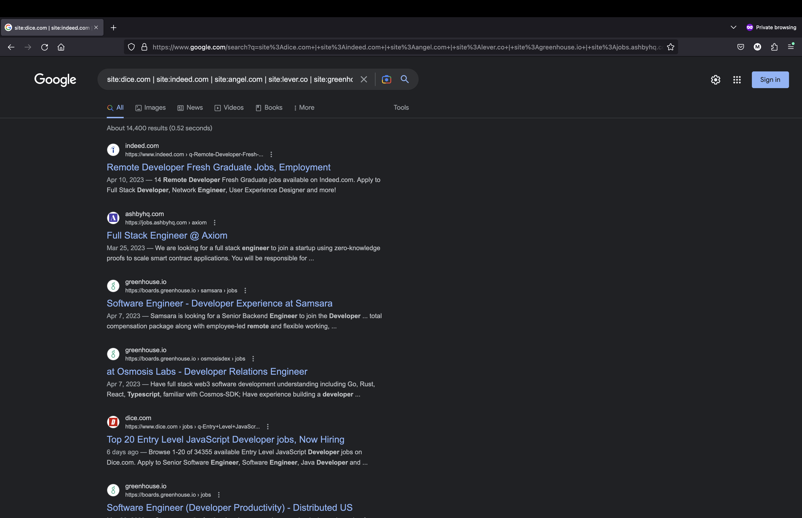

# Optimized Job Search

Generate a Google query to search for specific job posts across multiple job boards.



## Installation

```
$ git clone git@github.com:MrcRjs/optimized-job-search.git && cd optimized-job-search
$ npm install
$ chmod +x ./index.js
```

## Usage

Update `sites`, `roles`, `keywords`, `excludes` with your own criteria.

Run `./index.js` and it will automatically open your browser with the google search.
